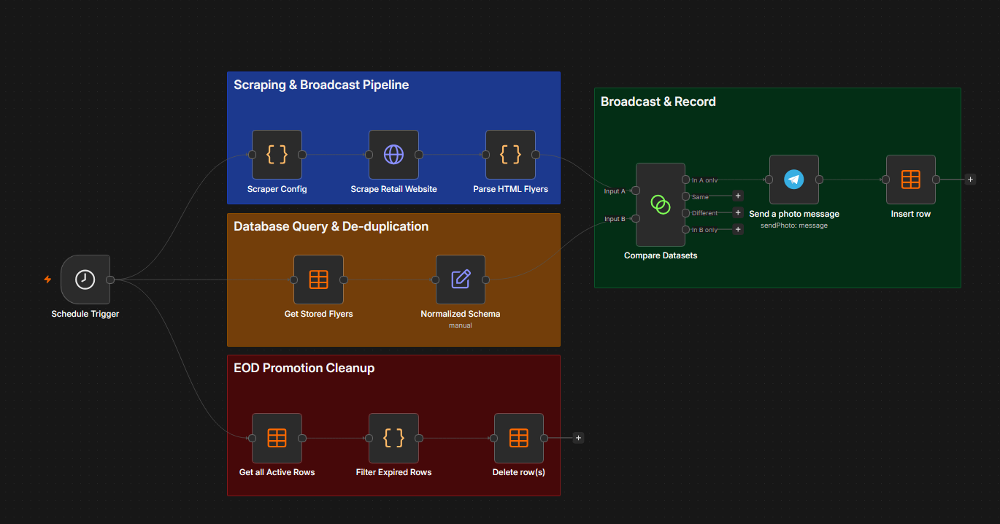
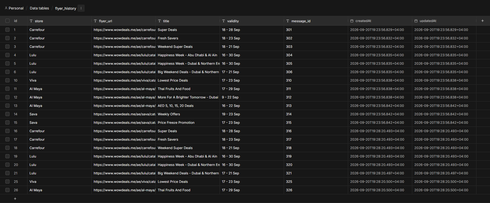
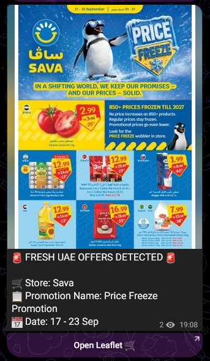

# RetailRadar UAE

An automated data pipeline built with **n8n** that collects publicly available UAE retail offer information, processes and compares incoming records, tracks previously detected promotions, and sends notifications when new offers are found.

## What it does

The workflow currently monitors retail offer pages from selected UAE stores and:

* Collects offer/flyer information from public webpages
* Extracts relevant fields such as store, title, validity and URL
* Processes and cleans the collected data with JavaScript
* Detects previously processed offers
* Stores offer history in an n8n Data Table
* Sends new offers to Telegram
* Removes expired offers from the tracking table
* Runs automatically on a scheduled basis

## Workflow



## Tech Stack

* n8n
* JavaScript
* HTTP Requests
* HTML data extraction
* n8n Data Tables
* Telegram Bot API
* Scheduled workflows

##Implementation Notes

I initially considered using Google Sheets to store offer history, but switched to n8n Data Tables so the tracking data could stay within the n8n workflow and avoid adding another external dependency.

## Data Flow

The workflow follows a simple ETL-style process:

**Collect → Extract → Clean → Compare → Store → Notify**



The collected records contain fields such as:

| Field     | Description                        |
| --------- | ---------------------------------- |
| Store     | Retailer name                      |
| Flyer URL | Link to the original offer         |
| Title     | Offer/flyer title                  |
| Validity  | Offer validity information         |
| Image URL | Source image used for notification |
| Status    | Current offer status               |

## Why I Built This

I wanted to experiment with automating a repetitive data collection process instead of manually checking multiple retail websites for new promotions.

The project gave me practical experience with data extraction, transformation, deduplication, persistence, scheduling and automated notifications.

## Responsible Use

This project uses publicly accessible retail offer information for demonstration and portfolio purposes.

It does not bypass authentication or access private information, and the repository does not contain authentication credentials, API keys, cookies or private account information.

This project is not affiliated with or endorsed by WowDeals or the retailers represented in the collected information.

The workflow is intended as a portfolio demonstration of data automation and ETL concepts.

## Setup

1. Install or access an n8n instance.
2. Import the workflow JSON from `workflow/`.
3. Configure your own Telegram credentials.
4. Configure your own n8n Data Table.
5. Replace the placeholder IDs and Telegram destination.
6. Review the source websites' applicable policies before running the workflow.
7. Activate the workflow.

### Required configuration

The GitHub workflow uses placeholders for:

```text
YOUR_TELEGRAM_CREDENTIAL_ID
YOUR_TELEGRAM_CHANNEL
YOUR_DATA_TABLE_ID
YOUR_PROJECT_ID
YOUR_WORKFLOW_ID
```

These need to be replaced with values from your own n8n environment.

## Example

When a new offer is detected, the workflow sends a Telegram notification containing the store, offer title, validity information and a link to the original webpage.




## Skills Demonstrated

* Data collection
* ETL pipeline design
* Data cleaning
* Deduplication
* JavaScript data processing
* Workflow automation
* Data persistence
* Scheduling
* API integration
* Exception/expiry handling
